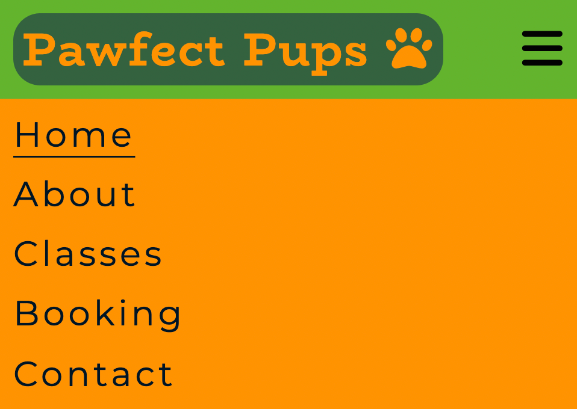
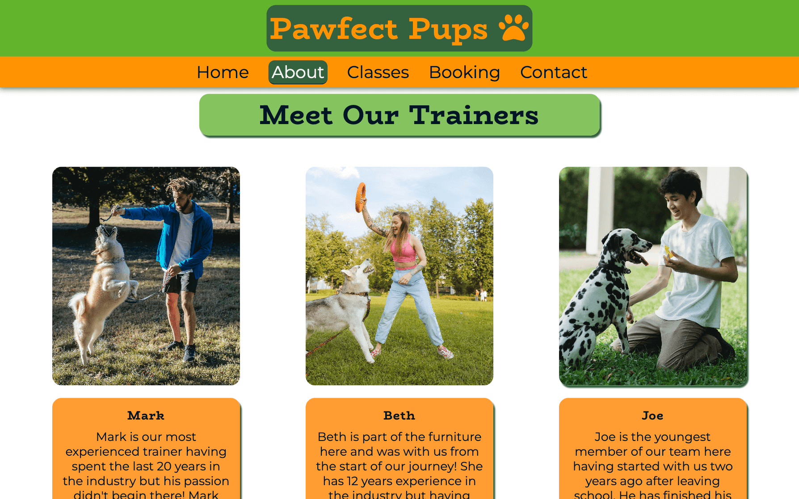
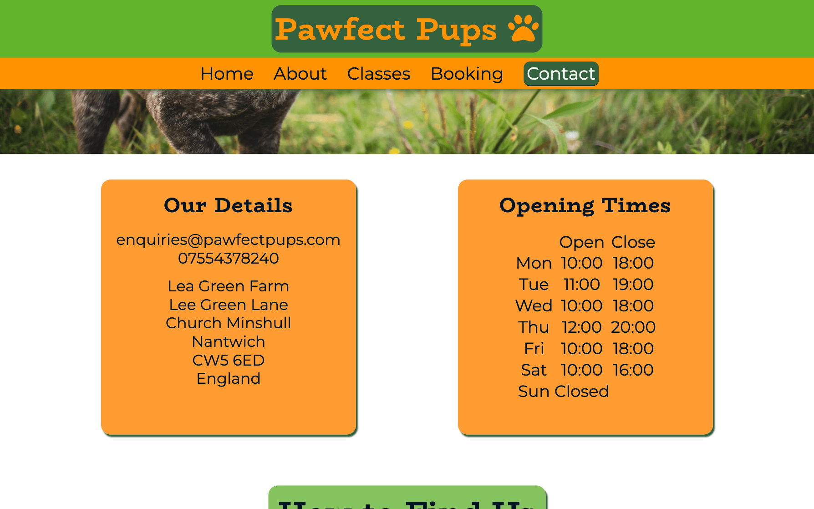
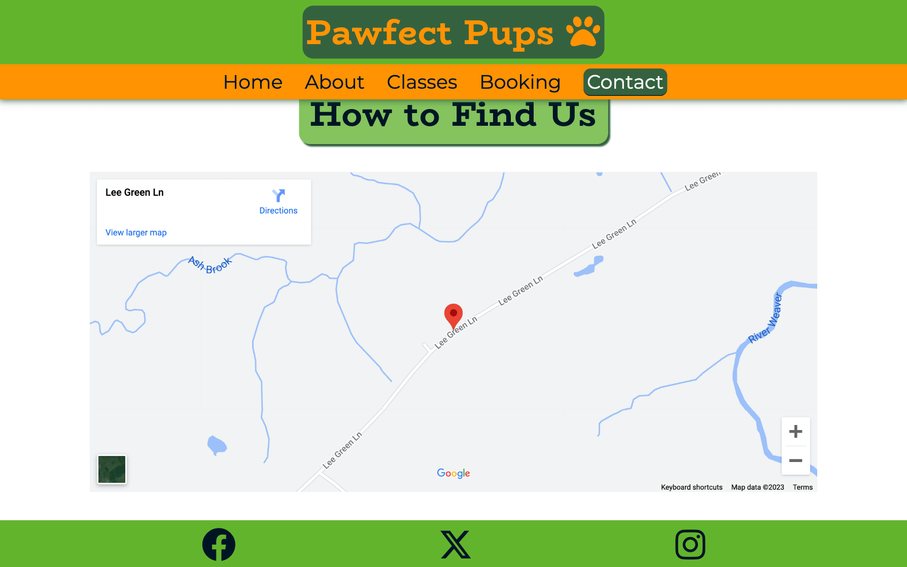
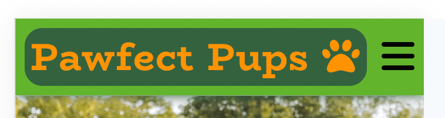
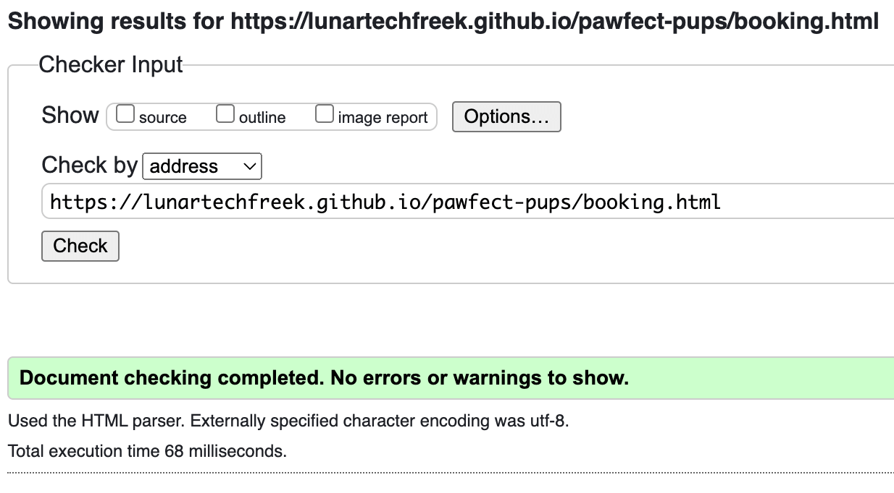
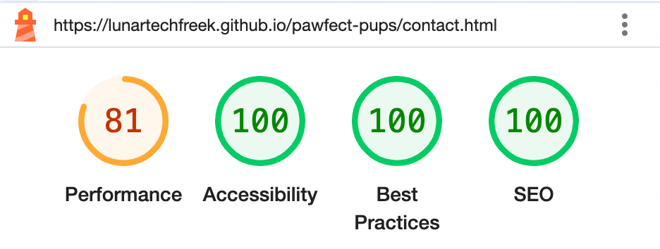

# Testing

## User Story Testing

This site has been designed with the aim to achieve all user goals. These are broken down as follows:

### External - New User Goals

* As a new user I want to, find a good dog trainer.
  * Slogan featured on home page stating that the company are the best local dog trainers.

* As a new user I want to, find a suitable training class.
  * The classes page showcases the broad selection of classes available.

* As a new user I want to, navigate the site with ease.
  * There is a fixed navigation bar or hamburger menu always available at the top of the screen for easy navigation.

* As a new user I want to, use a well layed out and visually appealing website.
  * Layed out in a hierarchical tree structure for a familiar feel and easy navigation. Vibrant colour palette chosen using [Coolers](https://coolors.co/) with the specific company in mind to create an image that compliments the company.

* As a new user I want to, easily find relevant information.
  * All links in the navigation bar are named in accordance to their content displayed on them and are listed in order of importance to make for easy navigation.

* As a new user I want to, see pictures of the training they offer.
  * Hero image on home page of one of our trainers with a dog so its the first thing the user will see upon the first visit of the page. Also a trainers section with pictures of trainers in action on the about page, and also the classes page.

* As a new user I want to, be able to find where they are located with ease.
  * Address is on contact page and to make for an easier user experience a embedded google map on the same page.

### External - Current User Goals

* As a current user I want to, navigate the site with ease.
  * There is a fixed navigation bar or hamburger menu always available at the top of the screen for easy navigation.

* As a current user I want to, see that the website is updated regularly with any changed to the trainers, classes or the contact details.
  * If this were to be a real website details would be update on a regular basis as needed.

### Site Owner Goals

* As the site owner I want to, build my business online.
  * Created a site meeting all user goals.

* As the site owner I want to, show the full range of the services we offer.
  * Dedicated classes page to showcase services available.

* As the site owner I want to, show the user our dog trainers.
  * Trainers section introducing the trainers on the about page.

* As the site owner I want to, provide a visually friendly user experience.
  * Vibrant colour palette created using [Coolers](https://coolors.co/) with the specific company in mind to create an image that compliments the company.

* As the site owner I want to, provide an easy to navigate website.
  * On larger screens there is a navigation bar with all links always visable and fixed to the top of the screen. On smaller screens these links have been reduced to a hamburger menu which is clearly visible and always fixed at the top of the screen for easy access.

* As the site owner I want to, show the user photos from our training sessions.
  * Photos of dog trainers in action on the home page hero image, and also in the trainers section on the about page.

* As the site owner I want to, provide clear contact details and where to find us.
  * Address is located on the contact page with an iframe of an embedded google map below it to make the customers experience of finding us as easy as possible.

## Manual Testing

I did the majority of my testing using Chrome DevTools as I was creating the website. I found it best to test that the website was fully responsive as I went along and would fix any issue I found before moving on to the next page. I also used chromes built in device viewports frequently. This came in particularly handy when designing the website with a mobile first approach.

I would then test the page on tablet viewports such as iPad Air and Surface Pro 2 and make any changes or add any media queries. Next I would change the viewport size to desktop and eventually 4k resolution making the necessary changes. After that I would start to look at the viewports on their side such as mobile and tablet. And finally I would set the viewport to responsive and manually adjust the size of it as I went to ensure the website would be fully responsive. I found this exceptionally useful as I found bugs in between the sizes of certain viewports which I would never have found without manually adjusting the viewport size.

I deployed my website very early on to github pages whilst only the header and footer were complete. I did this to make sure that it was displayed as expected and if necessary this would have gave me the opportunity to fix these issues early on. Luckily I did not encounter any issues upon deployment.

Once I had done this I was able to deploy it on a real phone so I tested it on my iphone 13 pro max regualarly. When doing this i encountered my bug mentioned in the Issues section where the text on the about page.

Since deploying the website through github pages and through the help of family and friends my website has been deployed on a variety of physical devices including:

* Iphone 13 Pro Max
* Iphone 14 Pro
* Iphone 15 Pro Max
* Galaxy S22 ultra
* iPad Pro
* iPad Air

## Device Testing

As well as testing on real world devices I wanted to test on other devices that I could not access. For this i used [BrowserStack](https://www.browserstack.com/). I tested the the website on various mobile and tablet devices, and also various mobile browsers on these devices. See some examples below:

## Browser Testing

I had already tested the site on Chrome and Safari with no issues, but I also used BrowserStack to test my website on other browsers such as Microsoft Edge, Firefox and Opera. Screenshots of these are included below:

## Element Testing

I performed manual tests on all the interactive elements that appear on every page. The results were as follows:

#### Header

* Responsive design changing the header navigation between a navigation bar and hamburger menu through use of media queries and hiding the one not in use.

* Hamburger icon opens menu and re-clicking closes it.

* Active class on mobile of underline works on the page the urer is currently on.

* Active class on desktop navigation bar turns the link of the current page dark green so the user knows what page they are currently on.

* Hover psuedo class on desktop navigation links turn them light green when hovered over and cursor changes to pointer.

### Footer

* Footer links have hover psuedo class applied to them to change colour when hovered over.

* Footer links open link in new tab.

### Home Page

* Hover psuedo class applied on the large links on the head over to section change the overlay colour to dark green and the font to orange when hovered over.

### Booking

* Form inputs have required applied to them where neccessary.

* Form checkboxes, submit and reset inputs all have a hover psuedo class applied to them to make them change colour when hovered over. The cursor also changes to a pointer.

* Form checkboxes also have a checked style applied to them so that they change colour when they have been checked.

* When the form has been completed and the submit button pressed it will take you to a new page.

### Contact

* The map is embedded correctly and is fully interactive.

## Code Validation Testing

### HTMl Validation

To validate my HTML code I used the [W3C Markup Validation Service](https://validator.w3.org/). I ran each page through the validator one at a time. It is worth noting I encountered a repeat error message throughout the pages. This was because I used two `h1` elements because I didn't realise at the time that I had used a `h1` element in my header so this failed validation. I fixed this issue by changing all of my other headings on the main body of the page by +1. The results of each page before and after fixing plus details of how I fixed the issues were as follows:

#### Home Page

The only issues on the home page were the common issue I found due to incorrectly numbering heading elements and were fixed using the above explanation.

#### About Page

The only issues on the about page were the common issue I found due to incorrectly numbering heading elements and were fixed using the above explanation.

#### Classes Page

The only issues on the classes page were the common issue I found due to incorrectly numbering heading elements and were fixed using the above explanation.

#### Booking Page

The only issues on the booking page were the common issue I found due to incorrectly numbering heading elements and were fixed using the above explanation.

#### Completed Booking Page

On the completed booking form page I found my common heading issue but also an issue regarding the button I had used. I had used a button and wrapped a anchor element around it to make it a link back to my home page. I did not realise this was invalid code. I first tried to instead wrap the anchor element inside of the button but this also did not pass validation. I chose to remove the button element completely and instead stlye the anchor element to look like a button.

#### Contact Page

On the contact page I found my common heading issue but also found two new ones. I had used a ` ` element in my in the info box to separate the contact details and the address. This failed the validation. To fix this I removed the ` ` element and instead made an id on the second list element and added a margin to the bottom to push the other list items down.

The second issue I encountered was in my table containing the opening times. I had only used one row on the bottom of the table to state that we are closed on sundays so therefore didn't need an opening and closing time. To fix this I added a blank row which fixed the issue.

### CSS Validator

To validate my CSS code I used the jigsaw. I copied all of my CSS code into the direct input section of the validator. This passed the validation test first time with no issues. It did have one warning due to the imported google fonts but this was to be expected as it cannot validate an externally imported stylesheet.

## Lighthouse Testing

I ran my lighthouse tests on Chrome DevTools and a common issue I found was that the performance scores on mobile were all amber. After reading the report in detail I found the main two issues causing this were the size of my images and also the use of Font Awesome.

 If this were a real website that would be constantly updated and developed I would take the time to resize all of my images and have different sets of images used for smaller screens and larger screens. I would do this by using the `srcset` attribute for `` elements and for background images I would use media queries to do this. I would also download my Font Awesome icons and insert them as `` elements instead to further increase the performance score.

### Home

|Mobile|Desktop|
| -- | -- |
|  | 

### About

|Mobile|Desktop|
| -- | -- |
|  | 

### Classes

|Mobile|Desktop|
| -- | -- |
|  | 

### Booking

|Mobile|Desktop|
| -- | -- |
|  | 

### Completed Form

|Mobile|Desktop|
| -- | -- |
|  | 

### Contact

|Mobile|Desktop|
| -- | -- |
|  | 

## User Testing

For my user tests I gathered help from my partner, my family and my friends and got them all to test the site on various devices and browsers to which they found no issues and all gave me positive feedback in regards to navigation, accessibility, and content.